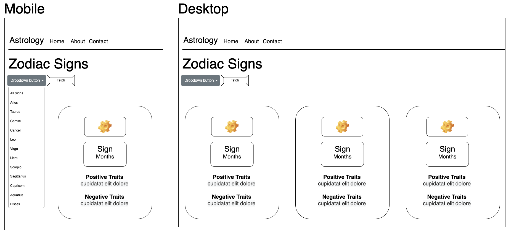

# ZodiacApi
Hosting Link: https://spilt-tea-creations.github.io/ZodiacApi/

## Used assets (non-commercial)

- Zodiac Sign Images from Pixabay: (license: https://pixabay.com/) 
- Bootstrap 5 integrations (https://getbootstrap.com/docs/5.0/about/license)
- zodiac information interpreted from: (https://askastrology.com/zodiac-signs/)

Zodiac User Stories: 

1.	As a psychic, I want to find the spiritual answers as to why my clients may feel and react a certain way, so I will give logical reasons in my reading explanations.
2.	As a Buddhist yogi, I want to learn more about the ayurvedic culture, so that I can progress in my path to enlightenment.

Wireframes:

Megan Stachnick

This app uses a combination of HTML, CSS, Bootstrap, and Javascript. My zodiac app uses a fetch function to pull zodiac sign JSON objects and allow users to view all signs or given the opporunity to select a sign with their linked months, commonly associatiated positive and negative traits. In effect, users can learn something new about astrological signs and how they connect them to people based on their birthdays. 
